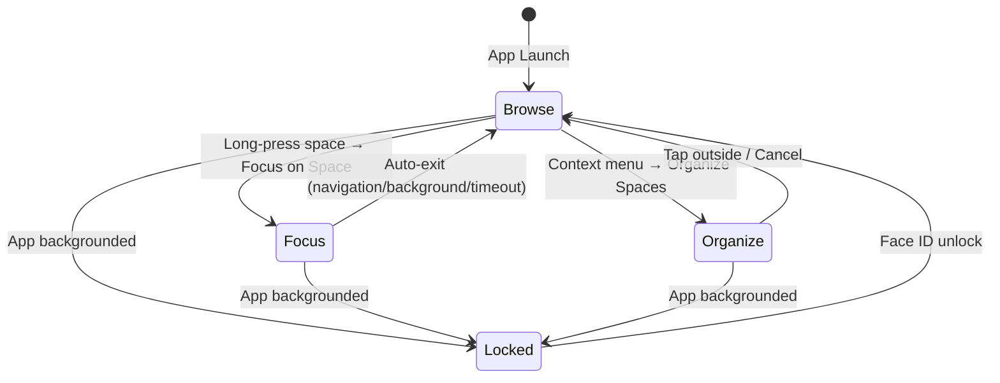
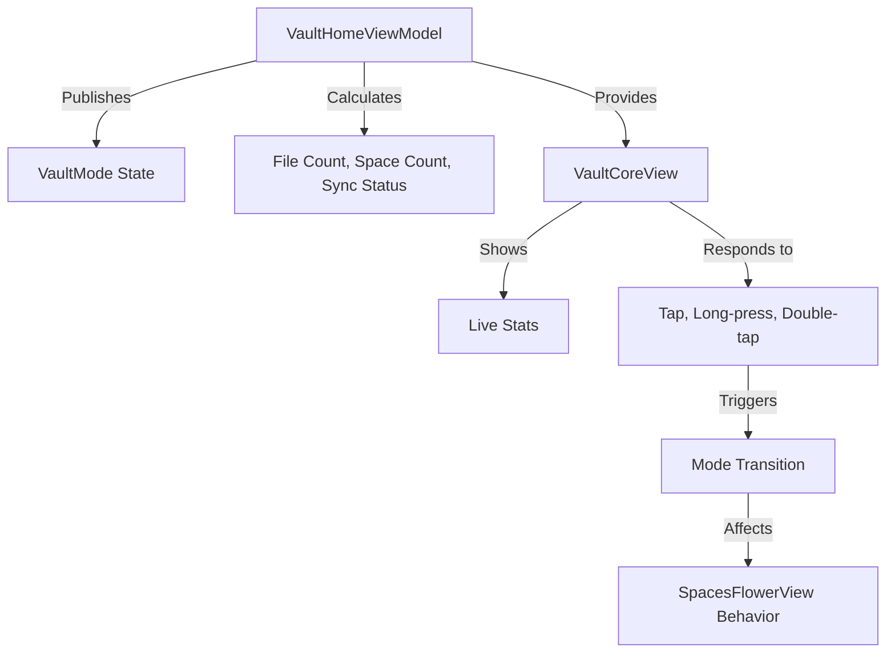

---

name: Vault Core Modes Implementation

overview: Implement the combined Vault Core system with always-visible live stats and mode-based behavior (Browse, Organize, Focus, Locked). Focus mode is triggered via long-press on space bubble → context menu. The center bubble shows real-time statistics and responds to gestures to control vault behavior.

todos:

  - id: "1"

content: Create VaultMode enum with browse, organize, focus(spaceId), and locked cases

status: pending

  - id: "2"

content: Update VaultHomeViewModel with mode state, stats properties, and mode management methods

status: pending

dependencies:

      - "1"
  - id: "3"

content: Replace VaultCoreView with enhanced version showing always-visible live stats and mode-based visuals

status: pending

dependencies:

      - "1"
      - "2"
  - id: "4"

content: Add center bubble context menu (long-press) with quick actions including Organize Spaces

status: pending

dependencies:

      - "3"
  - id: "5"

content: Add space bubble context menu (long-press) with Focus Mode option and info button

status: pending

status: pending

dependencies:

      - "1"
      - "2"
  - id: "6"

content: Update SpacesFlowerView to respond to mode changes (organize orbit, focus dimming)

status: pending

dependencies:

      - "1"
      - "2"
  - id: "7"

content: Add drag gestures to SpaceBubbleView for organize mode

status: pending

dependencies:

      - "6"
  - id: "8"

content: Implement mode transition animations with spring physics

status: pending

dependencies:

      - "3"
      - "6"
  - id: "9"

content: Add focus mode banner with exit button and auto-exit logic

status: pending

dependencies:

      - "3"
      - "6"
  - id: "10"

content: Add haptic feedback for mode changes and interactions

status: pending

dependencies:

      - "3"
      - "6"
  - id: "11"

content: Add lock/unlock integration with app lifecycle (background/foreground)

status: pending

dependencies:

      - "2"
      - "3"
  - id: "12"

content: Add focus mode info sheet explaining the feature

status: pending

dependencies:

      - "5"

---

# Vault Core Modes Implementation

## Overview

Transform the center "Vault Core" bubble into an interactive control center that always displays live stats and manages four distinct modes: Browse (default), Organize (via context menu), Focus (via space context menu), and Locked (app backgrounded). Live stats are always visible. Focus mode is temporary and auto-exits to prevent confusion.

## Architecture

### Mode System

### Data Flow

## Implementation Steps

### 1. Create VaultMode Enum

**File:** `Just Vault/Views/Vault/VaultHomeView.swift`

Add enum to define the four modes:

- `browse` - Default mode, calm glow
- `organize` - Context menu activated, orbit ring visual
- `focus(spaceId: String)` - Long-press space → context menu → "Focus on [Space]", bright pulse, dims other petals
- `locked` - App backgrounded, darkened/frosted

Focus mode uses `spaceId: String` (not optional) - always has a focused space.

### 2. Update VaultHomeViewModel

**File:** `Just Vault/Views/Vault/VaultHomeView.swift`

Add to `VaultHomeViewModel`:

- `@Published var vaultMode: VaultMode = .browse`
- `@Published var totalFileCount: Int = 0`
- `@Published var spaceCount: Int = 0`
- `@Published var syncStatus: SyncStatus = .synced`
- `@Published var focusedSpace: Space?` (computed from mode)
- Methods: `calculateStats()`, `enterOrganizeMode()`, `enterFocusMode(spaceId:)`, `exitFocusMode()`, `lockVault()`, `unlockVault()`
- Auto-exit focus mode on navigation/background/timeout

### 3. Replace VaultCoreView with Enhanced Version

**File:** `Just Vault/Views/Vault/VaultHomeView.swift`

Replace the simple `VaultCoreView` with:

- **Live Stats Display (Always Visible):**
  - File count (total or space-specific in focus mode)
  - Space count (or focused space name in focus mode)
  - Sync status indicator (colored dot)
- **Mode-Based Visuals:**
  - Browse: Soft breathing glow (subtle pulse animation)
  - Organize: Thin orbit ring around edge (animated)
  - Focus: Shows focused space icon + name, space-specific stats, bright core pulse
  - Locked: Darkened/frosted overlay
- **Gesture Handlers:**
  - Tap → Pulse + haptic feedback (no UI)
  - Long-press → Context menu with quick actions
- **Icon Changes by Mode:**
  - Browse: `lock.shield.fill`
  - Organize: `slider.horizontal.3`
  - Focus: Shows focused space icon
  - Locked: `lock.fill`

### 4. Add Center Bubble Context Menu

**File:** `Just Vault/Views/Vault/VaultHomeView.swift`

Add context menu to center bubble (long-press):

- "Organize Spaces" (enters organize mode)
- "Lock Vault" (if unlocked)
- "View All Files"
- "Sync Now" (if sync needed)
- "Settings"

Use SwiftUI's `.contextMenu` modifier for native iOS styling.

### 5. Update SpacesFlowerView for Mode Behavior

**File:** `Just Vault/Views/Vault/VaultHomeView.swift`Modify `SpacesFlowerView` to:

- Accept `vaultMode` binding from ViewModel
- **Browse Mode:** Normal tap behavior, static positions
- **Organize Mode:**
- Enable drag gestures on petals
- Add orbit animation (subtle rotation around center)
- Center becomes drop target (visual indicator)
- Petals can be reordered via drag
- **Focus Mode:**
- Dim all petals except selected one (opacity 0.3)
- Enlarge selected petal slightly (scale 1.1)
- Add pulsing glow to selected petal
- Filter interactions to selected space only

### 6. Add SpaceBubbleView Gesture Enhancements

**File:** `Just Vault/Views/Vault/VaultHomeView.swift`Update `SpaceBubbleView`:

- Add drag gesture (only active in Organize mode)
- Add selection state (for Focus mode)
- Add visual feedback (scale, glow) when selected
- Add haptic feedback on selection

### 7. Implement Mode Transition Animations

**File:** `Just Vault/Views/Vault/VaultHomeView.swift`Add smooth transitions:

- **Browse → Organize:** Petals begin gentle orbit, ring appears on center
- **Browse → Focus:** Selected petal enlarges, others fade, center pulses
- **Any → Locked:** Everything dims and blurs
- Use SwiftUI `.animation()` with spring physics for natural feel

### 8. Add Haptic Feedback

**File:** `Just Vault/Views/Vault/VaultHomeView.swift`Import `UIKit` and add haptic feedback:

- Light impact on mode entry
- Medium impact on space selection
- Success feedback on drop into center (organize mode)

### 5. Add Space Bubble Context Menu

**File:** `Just Vault/Views/Vault/VaultHomeView.swift`

Add context menu to space bubbles (long-press):

- "Focus on [Space Name]" (enters focus mode for that space)
- "Rename Space"
- "Change Icon"
- "Change Color"
- "ℹ️ What is Focus Mode?" (shows info sheet)
- "Delete Space" (if allowed)

### 9. Add Focus Mode Banner and Auto-Exit

**File:** `Just Vault/Views/Vault/VaultHomeView.swift`

Add focus mode banner:

- Shows "Focusing on [Space Name]" with exit button
- Auto-dismisses after 3 seconds (tap to show again)
- Exit button explicitly exits focus mode

Auto-exit triggers:

- User navigates (opens file, taps another space)
- App backgrounds
- 30 seconds of inactivity (optional)
- Explicit exit (banner button)

Focus mode never persists across app launches.

### 10. Add Lock/Unlock Integration

**File:** `Just Vault/Views/Vault/VaultHomeView.swift`Connect to app lifecycle:

- App goes to background → `lockVault()` → Mode becomes `.locked`
- App returns to foreground → Check Face ID → `unlockVault()` → Mode returns to `.browse`
- Visual: Center bubble shows locked state (darkened, frosted)

## Files to Modify

1. **`Just Vault/Views/Vault/VaultHomeView.swift`**

- Add `VaultMode` enum
- Update `VaultHomeViewModel` with mode state and stats
- Replace `VaultCoreView` with enhanced version
- Add `QuickActionsMenu` component
- Update `SpacesFlowerView` for mode behavior
- Update `SpaceBubbleView` with gestures
- Add animation and haptic feedback

## Key Implementation Details

### Stats Calculation

ViewModel will calculate:

- Total file count: Sum of `fileCount` from all spaces (or query all files if needed)
- Space count: `spaces.count`
- Sync status: Aggregate from all files (if any file is `.pending` or `.syncing`, show that status)

### Mode Persistence

- Mode resets to `.browse` on app launch
- Locked state persists until Face ID unlock
- Focus mode clears when user navigates away

### Performance

- Use `@State` for local UI state (animations)
- Use `@Published` for shared state (mode, stats)
- Debounce stats calculation if needed
- Use `withAnimation` for smooth transitions

## Testing Considerations

- Test all gesture combinations (tap, long-press, double-tap)
- Verify mode transitions are smooth
- Test focus mode with 0, 1, and multiple spaces
- Verify locked state on app backgrounding
- Test drag-and-drop in organize mode
- Verify haptic feedback on all interactions

## Future Enhancements (Not in This Plan)

- Pressure-based interactions (3D Touch)
- Idle micro-motion animations