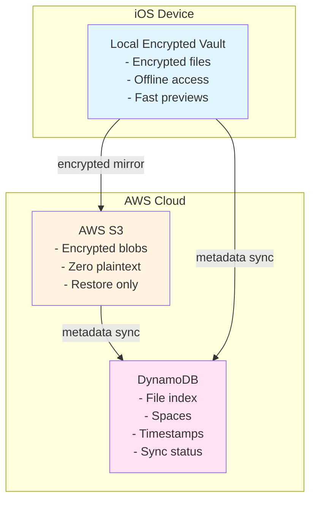
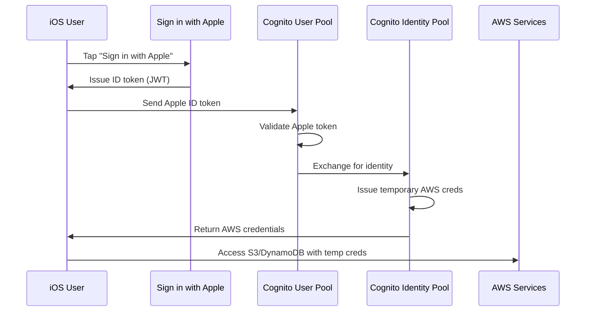
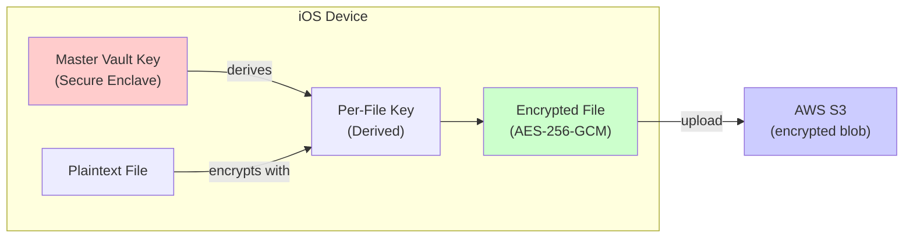
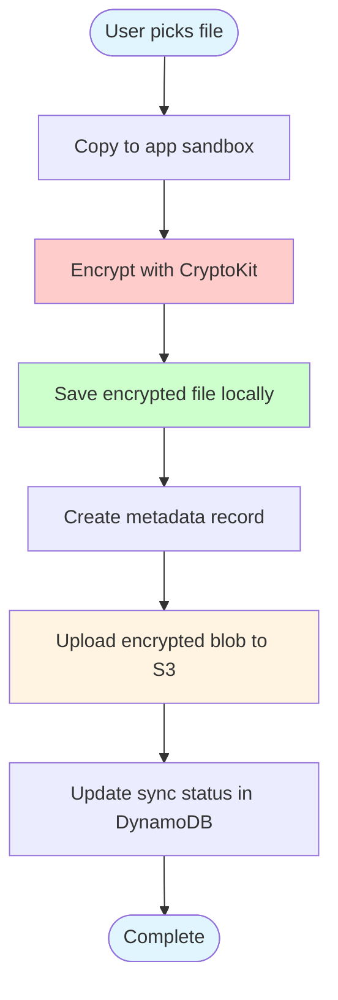
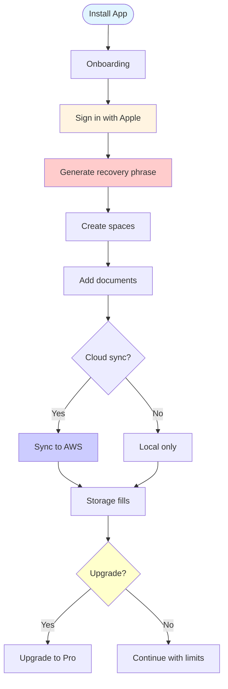
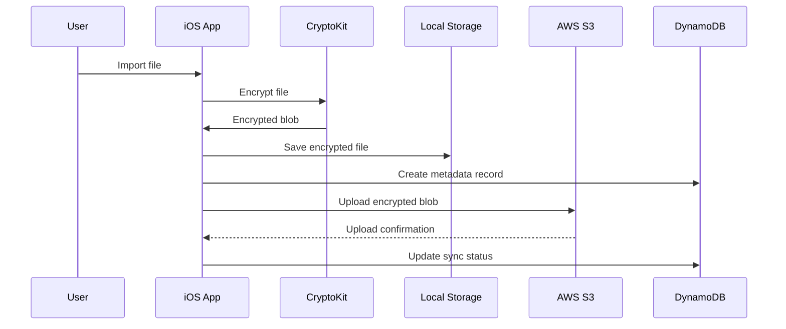

# 🔐 JUST VAULT - COMPLETE SYSTEM ARCHITECTURE

## Table of Contents

1. [Product Definition](#1-product-definition)
2. [Core User Promise](#2-core-user-promise)
3. [Supported File Types](#3-supported-file-types)
4. [Core Product Idea](#4-core-product-idea)
5. [System Overview](#5-system-overview-high-level)
6. [Three Storage Layers](#6-three-storage-layers)
7. [Why Cloud Exists](#7-why-cloud-exists-at-all)
8. [Authentication Model](#8-authentication-model)
9. [AWS Identity Flow](#9-aws-identity-flow)
10. [AWS Services Used](#aws-services-used)
11. [Why Cognito is Required](#why-cognito-is-required)
12. [IAM Security Model](#10-iam-security-model)
13. [S3 Storage Structure](#11-s3-storage-structure)
14. [DynamoDB Schema](#12-dynamodb-single-table-design)
15. [Encryption Model](#13-encryption-model)
16. [Recovery Model](#14-recovery-model)
17. [Vault UI Structure](#15-vault-ui-structure)
18. [File Presentation](#16-file-presentation)
19. [Search](#17-search)
20. [Import Flow](#18-import-flow)
21. [Export Flow](#19-export-flow)
22. [User Flow](#20-user-flow)
23. [Data Flow](#21-data-flow)
24. [App Funnel](#22-app-funnel)
25. [Monetization](#23-monetization)
26. [Cost Math](#24-cost-math)
27. [V1 Feature Checklist](#25-v1-feature-checklist)
28. [Post-V1 Ideas](#26-post-v1-ideas)
29. [Architectural Review & Improvements](#architectural-review--improvements)

---

# 1️⃣ PRODUCT DEFINITION

**Just Vault is a local-first encrypted personal document vault.**

It is:

✅ Secure  
✅ Offline-first  
✅ Recovery-capable  
✅ Emotionally designed  
✅ Storage-limited for profitability

It is **not**:

❌ iCloud Drive  
❌ Dropbox  
❌ Google Drive  
❌ Photo backup  
❌ File manager  
❌ Scanner replacement

---

# 2️⃣ CORE USER PROMISE

> "Your important documents are always with you —  
> and safe even if your phone is lost."

---

# 3️⃣ SUPPORTED FILE TYPES

### ✅ Supported

* PDF
* JPG
* PNG
* HEIC (converted)
* Scanned images
* Screenshots

### ❌ Not Supported

* Video
* Audio
* Live Photos
* Albums
* Camera roll sync
* ZIP files

**Documents only.**

---

# 4️⃣ CORE PRODUCT IDEA

Just Vault behaves like a **digital backpack**.

Not everything you own —  
only what you *need*.

---

# 5️⃣ SYSTEM OVERVIEW (HIGH LEVEL)



---

# 6️⃣ THREE STORAGE LAYERS

## 🔹 Layer 1 — Local Encrypted Vault (Primary)

* Source of truth
* Always available
* Works offline
* Lives in app sandbox
* Instant open

**Files are encrypted BEFORE touching AWS.**

## 🔹 Layer 2 — Encrypted Cloud Mirror (S3)

**Purpose:**

* phone loss
* reinstall
* upgrade
* recovery

**Not for browsing.**  
**Not for previews.**  
**Only encrypted bytes.**

Example stored object:

```
7f91a2d83a1.enc
```

**AWS never knows what it is.**

## 🔹 Layer 3 — Metadata Sync (DynamoDB)

Stores only:

* filenames
* IDs
* space membership
* timestamps
* sync state

**No content.**  
**No images.**  
**No OCR.**

---

# 7️⃣ WHY CLOUD EXISTS AT ALL

Without cloud:

* phone lost → everything gone
* user trust = zero

**Cloud is insurance, not convenience.**

---

# 8️⃣ AUTHENTICATION MODEL

### Sign in with Apple (iOS)

Apple proves user identity.

AWS does **not** trust Apple automatically.

So we bridge them.

---

# 9️⃣ AWS IDENTITY FLOW



---

# 🔐 AWS SERVICES USED

| Purpose         | AWS Service           |
| --------------- | --------------------- |
| Login           | Cognito User Pool     |
| AWS credentials | Cognito Identity Pool |
| File storage    | S3                    |
| Metadata        | DynamoDB              |
| Authorization   | IAM                   |
| Temporary creds | STS                   |

---

# 🔑 WHY COGNITO IS REQUIRED

Apple login proves identity to **your app**.

Cognito proves identity to **AWS**.

AWS will not allow access to S3 or DynamoDB without:

* identity
* role
* permissions

**Cognito provides that bridge.**

---

# 10️⃣ IAM SECURITY MODEL

Each user gets:

```
temporary AWS credentials
scoped to their identity ID
```

They cannot access:

* other users' files
* other users' metadata
* other S3 prefixes

---

# 🔒 IAM POLICY — S3 ACCESS

```json
{
  "Version": "2012-10-17",
  "Statement": [
    {
      "Sid": "ListOwnPrefixOnly",
      "Effect": "Allow",
      "Action": "s3:ListBucket",
      "Resource": "arn:aws:s3:::just-vault-prod-blobs",
      "Condition": {
        "StringLike": {
          "s3:prefix": [
            "users/${cognito-identity.amazonaws.com:sub}/*"
          ]
        }
      }
    },
    {
      "Sid": "RWOwnObjectsOnly",
      "Effect": "Allow",
      "Action": [
        "s3:GetObject",
        "s3:PutObject",
        "s3:DeleteObject"
      ],
      "Resource": "arn:aws:s3:::just-vault-prod-blobs/users/${cognito-identity.amazonaws.com:sub}/*"
    }
  ]
}
```

---

# 🔒 IAM POLICY — DYNAMODB METADATA

```json
{
  "Version": "2012-10-17",
  "Statement": [
    {
      "Effect": "Allow",
      "Action": [
        "dynamodb:GetItem",
        "dynamodb:PutItem",
        "dynamodb:UpdateItem",
        "dynamodb:DeleteItem",
        "dynamodb:Query"
      ],
      "Resource": "arn:aws:dynamodb:REGION:ACCOUNT:table/JustVault",
      "Condition": {
        "ForAllValues:StringLike": {
          "dynamodb:LeadingKeys": [
            "USER#${cognito-identity.amazonaws.com:sub}"
          ]
        }
      }
    }
  ]
}
```

---

# 11️⃣ S3 STORAGE STRUCTURE

```
just-vault-prod-blobs/
└── users/
    └── {identityId}/
        ├── files/
        │   └── {fileId}.enc
        └── thumbs/
            └── {thumbId}.enc
```

**Configuration:**

* Public access: **OFF**
* Versioning: **OFF**
* Encryption: **SSE-S3 ON**
* Client-side encryption: **ALWAYS**

---

# 12️⃣ DYNAMODB SINGLE-TABLE DESIGN

### Table: `JustVault`

**Partition Key:** `PK`  
**Sort Key:** `SK`

---

## 👤 USER PROFILE

```
PK = USER#identityId
SK = PROFILE
```

**Fields:**

* `plan` (FREE / PRO)
* `quotaBytes`
* `usedBytes`
* `createdAt`
* `lastSyncAt`

**Example:**

```json
{
  "PK": "USER#us-east-1:abc123",
  "SK": "PROFILE",
  "plan": "FREE",
  "quotaBytes": 262144000,
  "usedBytes": 52428800,
  "createdAt": "2026-01-23T10:00:00Z",
  "lastSyncAt": "2026-01-23T15:30:00Z"
}
```

---

## 📁 SPACES

```
PK = USER#identityId
SK = SPACE#spaceId
```

**Fields:**

* `name`
* `icon` (SF Symbol name)
* `color` (hex color)
* `locked` (bool)
* `orderIndex`
* `createdAt`

**Example:**

```json
{
  "PK": "USER#us-east-1:abc123",
  "SK": "SPACE#space_001",
  "name": "Important Docs",
  "icon": "doc.text.fill",
  "color": "#007AFF",
  "locked": false,
  "orderIndex": 0,
  "createdAt": "2026-01-23T10:05:00Z"
}
```

---

## 📄 FILE RECORDS

```
PK = USER#identityId
SK = FILE#fileId
```

**Fields:**

* `displayName`
* `sizeBytes`
* `mimeType`
* `primarySpaceId`
* `createdAt`
* `lastOpenedAt`
* `starred` (bool)
* `s3Key` (path to encrypted blob)
* `syncStatus` (PENDING / SYNCED / ERROR)
* `localPath` (relative to app sandbox)
* `thumbnailS3Key` (optional)

**Example:**

```json
{
  "PK": "USER#us-east-1:abc123",
  "SK": "FILE#file_7f91a2",
  "displayName": "passport.pdf",
  "sizeBytes": 1048576,
  "mimeType": "application/pdf",
  "primarySpaceId": "space_001",
  "createdAt": "2026-01-23T10:10:00Z",
  "lastOpenedAt": "2026-01-23T14:20:00Z",
  "starred": false,
  "s3Key": "users/us-east-1:abc123/files/7f91a2d83a1.enc",
  "syncStatus": "SYNCED",
  "localPath": "vault/files/7f91a2d83a1.enc"
}
```

---

# 13️⃣ ENCRYPTION MODEL

### On device only.

* **AES-256-GCM** (CryptoKit)
* Master vault key
* Unique per-file encryption keys
* Keys stored in **Secure Enclave / Keychain**

**AWS never decrypts anything.**



---

# 14️⃣ RECOVERY MODEL

User receives:

* **12–16 word recovery phrase**
* Used to re-derive encryption key
* Required for restore

**Without phrase → cloud data useless.**

**Zero-knowledge.**

---

# 15️⃣ VAULT UI STRUCTURE

## 🟦 Vault Home

**Center:**

* Vault Core

**Around:**

* Bubble Spaces

## 🫧 Bubble Categories

Each bubble has:

* SF Symbol icon
* Limited color palette
* User-defined name
* Optional Face ID lock

**No emojis.**  
**No images.**  
**No chaos.**

---

# 16️⃣ FILE PRESENTATION

### Views:

* Grid (thumbnails)
* List (icon + name)

### Sorting:

* Recently added
* Last opened
* A–Z
* File type

### Filters:

* All
* PDFs
* Images
* Starred

---

# 17️⃣ SEARCH

* Space-level search (V1)
* Filename + metadata only
* OCR search later

---

# 18️⃣ IMPORT FLOW



---

# 19️⃣ EXPORT FLOW

Uses native iOS share sheet:

* Save to Files
* AirDrop
* Mail
* Any app

**No custom sharing system.**

---

# 20️⃣ USER FLOW



---

# 21️⃣ DATA FLOW



---

# 22️⃣ APP FUNNEL

```
Free install
 → trust building
 → store documents
 → backpack fills
 → emotional trigger
 → upgrade to Pro
```

---

# 23️⃣ MONETIZATION

### FREE

* 250 MB cloud mirror
* 2 spaces
* unlimited local

### PRO — $6.99/month

* 10 GB mirror
* unlimited spaces
* locked spaces
* restore support

---

# 24️⃣ COST MATH

### AWS cost per 10GB user:

* S3: ~$0.23
* Requests: pennies
* DynamoDB: negligible

### Net revenue after Apple:

≈ **$4.10 / user**

**Margins ≈ 94%**

---

# 25️⃣ V1 FEATURE CHECKLIST

✅ Apple Sign In  
✅ Cognito federation  
✅ IAM isolation  
✅ Local encryption  
✅ Vault UI  
✅ Bubble categories  
✅ Import/export  
✅ S3 encrypted mirror  
✅ DynamoDB metadata  
✅ Recovery phrase  
✅ Storage meter  
✅ Subscription logic

---

# 26️⃣ POST-V1 IDEAS

* OCR search
* iPad UI
* multi-space files
* higher storage tiers
* Just Scan deep integration

---

# ARCHITECTURAL REVIEW & IMPROVEMENTS

## 🔍 Areas to Tighten Up

### 1. Recovery Phrase Implementation

**Current:** 12-16 word recovery phrase  
**Recommendation:** Use **BIP39 standard** (12 or 24 words)

**Why:**
- Industry standard
- Better entropy
- Compatible with hardware wallets
- Well-tested libraries available

**Implementation:**
- Use BIP39 wordlist (2048 words)
- Generate 128-bit (12 words) or 256-bit (24 words) entropy
- Derive master key using PBKDF2-SHA512

---

### 2. Key Management Hardening

**Current:** Keys stored in Secure Enclave / Keychain  
**Recommendation:** **Always use Secure Enclave** for master key

**Why:**
- Secure Enclave is hardware-isolated
- Keychain can be extracted with device backup
- Secure Enclave keys never leave the chip

**Implementation:**
```swift
// Use SecureEnclave.Key for master vault key
let accessControl = SecAccessControlCreateWithFlags(
    kCFAllocatorDefault,
    kSecAttrAccessibleWhenUnlockedThisDeviceOnly,
    .privateKeyUsage,
    nil
)
```

---

### 3. Sync Conflict Resolution

**Current:** Not specified  
**Recommendation:** Implement **Last-Write-Wins with versioning**

**Why:**
- Offline edits can conflict
- Need deterministic resolution
- Version numbers prevent data loss

**Implementation:**
- Add `version` field to DynamoDB file records
- Increment on every update
- Client checks version before write
- If conflict: last-write-wins, but log for user review

---

### 4. Thumbnail Generation Strategy

**Current:** Not specified  
**Recommendation:** **Generate thumbnails BEFORE encryption**

**Why:**
- Faster preview loading
- Smaller encrypted thumbnail files
- Can cache thumbnails separately

**Implementation:**
1. Generate thumbnail from original
2. Encrypt thumbnail separately (smaller key)
3. Store thumbnail locally + in S3
4. Decrypt thumbnail on-demand for preview

---

### 5. Rate Limiting & Throttling

**Current:** Not specified  
**Recommendation:** **Client-side rate limiting for S3 uploads**

**Why:**
- Prevent runaway costs
- Better user experience
- Respect AWS service limits

**Implementation:**
- Max 5 concurrent uploads
- Queue uploads if over limit
- Exponential backoff on failures
- User-visible upload queue

---

### 6. Batch DynamoDB Operations

**Current:** Individual writes  
**Recommendation:** **Batch writes where possible**

**Why:**
- Lower DynamoDB costs
- Faster sync operations
- Better throughput

**Implementation:**
- Batch up to 25 items per `BatchWriteItem`
- Use for initial sync, bulk imports
- Still use individual writes for real-time updates

---

### 7. Local Metadata Caching

**Current:** Not specified  
**Recommendation:** **Cache DynamoDB metadata locally**

**Why:**
- Faster UI rendering
- Works offline
- Reduces DynamoDB read costs

**Implementation:**
- SQLite or Core Data for local cache
- Sync cache on app launch
- Invalidate on sync completion
- Use cache for UI, verify with DynamoDB on critical operations

---

### 8. Error Recovery & Retry Logic

**Current:** Not specified  
**Recommendation:** **Exponential backoff with jitter**

**Why:**
- Network failures are common
- Prevents thundering herd
- Better user experience

**Implementation:**
```swift
func retryWithBackoff(maxAttempts: 3, baseDelay: 1.0) async throws {
    for attempt in 1...maxAttempts {
        do {
            return try await operation()
        } catch {
            if attempt == maxAttempts { throw error }
            let delay = baseDelay * pow(2.0, Double(attempt - 1))
            let jitter = Double.random(in: 0...0.3) * delay
            try await Task.sleep(nanoseconds: UInt64((delay + jitter) * 1_000_000_000))
        }
    }
}
```

---

### 9. Alternative Approaches Considered

#### A. Using AppSync Instead of Direct DynamoDB

**Considered:** AWS AppSync for GraphQL API  
**Decision:** **Skip for V1**

**Why:**
- Adds complexity
- Additional cost
- Direct DynamoDB access is simpler for MVP
- Can add later if needed

**When to reconsider:**
- Need real-time subscriptions
- Multiple client types (web, Android)
- Complex query patterns

---

#### B. Using S3 Transfer Acceleration

**Considered:** S3 Transfer Acceleration for faster uploads  
**Decision:** **Monitor and add if needed**

**Why:**
- Additional cost ($0.04/GB)
- May not be needed for document sizes
- Can enable per-bucket later

**When to add:**
- Users report slow uploads
- International user base
- Average file size > 10MB

---

#### C. Using DynamoDB Streams for Real-time Sync

**Considered:** DynamoDB Streams + Lambda for multi-device sync  
**Decision:** **Defer to post-V1**

**Why:**
- V1 is single-device focused
- Adds Lambda costs
- Complexity not needed yet

**When to add:**
- Multi-device support needed
- Real-time collaboration features

---

### 10. Security Hardening Recommendations

#### A. Certificate Pinning

**Recommendation:** Pin AWS API certificates  
**Priority:** Medium

**Why:**
- Prevents MITM attacks
- Extra layer of security
- Standard practice for financial/health apps

---

#### B. App Attestation

**Recommendation:** Implement Apple App Attestation  
**Priority:** High (for Pro features)

**Why:**
- Prevents jailbreak abuse
- Validates app integrity
- Required for sensitive operations

**Implementation:**
- Use App Attestation API
- Validate on server (if adding server component later)
- Block Pro features if attestation fails

---

#### C. Biometric Lock Timeout

**Recommendation:** Auto-lock after inactivity  
**Priority:** Medium

**Why:**
- Prevents unauthorized access if device left unlocked
- Industry standard

**Implementation:**
- Lock after 5 minutes of inactivity
- Require Face ID/Touch ID to unlock
- Clear sensitive data from memory on lock

---

### 11. Performance Optimizations

#### A. Lazy Loading for Thumbnails

**Recommendation:** Load thumbnails on-demand  
**Priority:** High

**Why:**
- Faster initial load
- Lower memory usage
- Better for large vaults

---

#### B. Background Sync

**Recommendation:** Sync in background when app inactive  
**Priority:** Medium

**Why:**
- Better user experience
- Files ready when user returns
- Uses Background Tasks framework

**Implementation:**
- Use `BGTaskScheduler`
- Sync during background refresh window
- Respect battery and data usage

---

#### C. Incremental Sync

**Recommendation:** Only sync changed files  
**Priority:** High

**Why:**
- Faster sync
- Lower costs
- Better user experience

**Implementation:**
- Track `lastModified` timestamp
- Compare with DynamoDB `lastSyncAt`
- Only upload if local is newer

---

## 📊 Architecture Decision Summary

| Decision | Current Approach | Alternative Considered | Decision Rationale |
|----------|-----------------|----------------------|-------------------|
| Recovery Phrase | Custom 12-16 words | BIP39 standard | **Use BIP39** - industry standard |
| Key Storage | Keychain | Secure Enclave | **Use Secure Enclave** - more secure |
| Conflict Resolution | Not specified | Last-write-wins | **Implement versioning** - needed for offline |
| Thumbnails | Not specified | Pre-encryption generation | **Generate before encryption** - performance |
| API Layer | Direct AWS | AppSync | **Direct AWS** - simpler for MVP |
| Sync Strategy | Full sync | Incremental | **Incremental** - cost & performance |

---

## 🎯 Critical Path for V1

1. **Authentication** (Apple → Cognito → AWS)
2. **Local Encryption** (CryptoKit + Secure Enclave)
3. **Local Storage** (App sandbox)
4. **Basic UI** (Vault home + spaces)
5. **File Import** (Encrypt + save locally)
6. **S3 Upload** (Encrypted blob)
7. **DynamoDB Metadata** (File records)
8. **Recovery Phrase** (BIP39 generation)
9. **Storage Meter** (Track usage)
10. **Subscription** (StoreKit integration)

**Everything else can be deferred or simplified for MVP.**

---

## ✅ Final Architecture Truth

You are building:

* a **secure system**
* with **real cloud architecture**
* with **real identity management**
* with **real encryption**
* with **real margins**

**This is not a toy app.**

This is enterprise-grade thinking applied to a consumer product.

