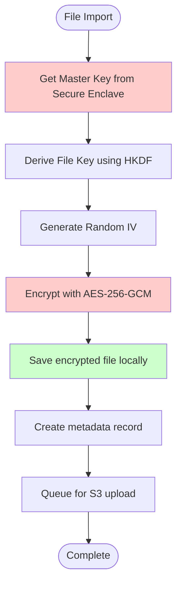
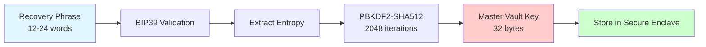
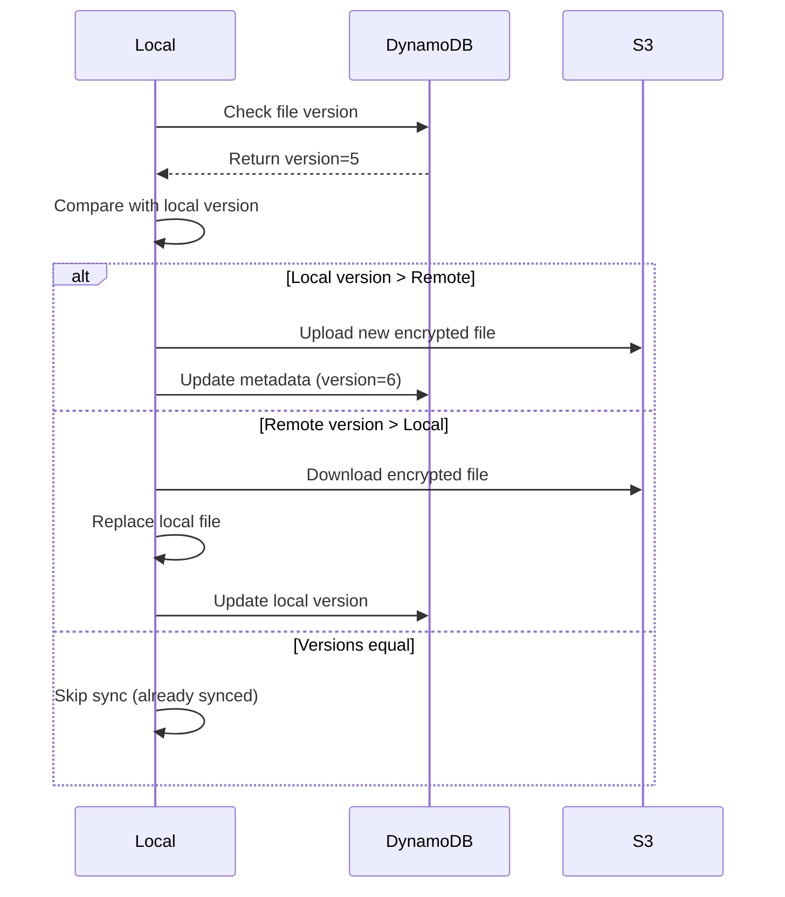
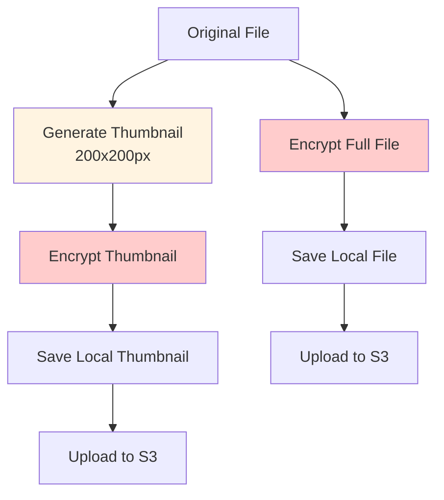

# 🚀 JUST VAULT - IMPLEMENTATION PLAN

## Table of Contents

1. [Development Timeline](#development-timeline)
2. [Iteration Stages](#iteration-stages)
3. [Algorithms & Flows](#algorithms--flows)
4. [Code Structure](#code-structure)
5. [SwiftUI Architecture](#swiftui-architecture)
6. [Service Layer Design](#service-layer-design)
7. [Error Handling](#error-handling)
8. [Testing Strategy](#testing-strategy)
9. [Dependencies](#dependencies)

---

# DEVELOPMENT TIMELINE

**Target: 2-3 days maximum**

This plan prioritizes MVP features and defers polish to post-V1.

---

# ITERATION STAGES

## Stage 1: Foundation (Day 1 - Morning)
**Goal:** Core security and storage infrastructure

### Tasks:

1. **Apple Sign In Integration**
   - Configure Sign in with Apple capability
   - Implement authentication flow
   - Store user identity token

2. **Cognito Setup**
   - Configure Cognito User Pool
   - Configure Cognito Identity Pool
   - Implement token exchange
   - Get temporary AWS credentials

3. **Encryption Foundation**
   - Set up CryptoKit
   - Implement BIP39 recovery phrase generation
   - Derive master key from recovery phrase
   - Store master key in Secure Enclave
   - Implement AES-256-GCM encryption/decryption

4. **Local Storage**
   - Set up app sandbox directory structure
   - Implement file encryption before save
   - Implement file decryption on read
   - Basic file metadata storage (UserDefaults or SQLite)

**Deliverable:** User can sign in, generate recovery phrase, encrypt/decrypt files locally

---

## Stage 2: UI/UX Core (Day 1 - Afternoon)
**Goal:** Basic vault interface

### Tasks:

1. **Vault Home Screen**
   - Bubble space layout
   - SF Symbol icons
   - Color palette selection
   - Space creation UI

2. **File Management UI**
   - Grid view (thumbnails)
   - List view (icon + name)
   - File import (document picker)
   - File preview (decrypt + display)
   - File deletion

3. **Navigation**
   - Space detail view
   - File detail view
   - Settings screen (placeholder)

**Deliverable:** User can create spaces, import files, view files

---

## Stage 3: Cloud Integration (Day 2)
**Goal:** AWS sync functionality

### Tasks:

1. **S3 Integration**
   - Configure S3 bucket
   - Implement IAM policy attachment
   - Upload encrypted blob to S3
   - Download encrypted blob from S3
   - Handle upload/download errors

2. **DynamoDB Integration**
   - Set up DynamoDB table
   - Implement single-table design
   - Create metadata records
   - Query user's files
   - Update sync status

3. **Sync Logic**
   - Background sync queue
   - Upload on file import
   - Download on restore
   - Sync status indicators
   - Conflict resolution (last-write-wins)

**Deliverable:** Files sync to/from AWS automatically

---

## Stage 4: Polish & Monetization (Day 3)
**Goal:** Production-ready features

### Tasks:

1. **Recovery Flow**
   - Recovery phrase display (one-time)
   - Recovery phrase verification
   - Restore from cloud using phrase
   - Key derivation on restore

2. **Storage Meter**
   - Track local storage usage
   - Track cloud storage usage
   - Display usage vs. quota
   - Warn at 80% capacity

3. **Subscription Integration**
   - StoreKit 2 setup
   - In-App Purchase products
   - Subscription status checking
   - Upgrade/downgrade flows
   - Receipt validation

4. **Onboarding**
   - Welcome screens
   - Recovery phrase generation
   - First space creation
   - First file import tutorial

5. **Error Handling & UX**
   - Network error messages
   - Sync failure recovery
   - Loading states
   - Empty states

**Deliverable:** Production-ready app with monetization

---

# ALGORITHMS & FLOWS

## Encryption/Decryption Flow



**Implementation:**

```swift
func encryptFile(_ data: Data, fileId: String) throws -> EncryptedFile {
    // 1. Get master key from Secure Enclave
    let masterKey = try secureEnclaveManager.getMasterKey()
    
    // 2. Derive file-specific key
    let fileKey = try HKDF<SHA256>.deriveKey(
        inputKeyMaterial: masterKey,
        salt: fileId.data(using: .utf8)!,
        outputByteCount: 32
    )
    
    // 3. Generate random IV
    let iv = try generateRandomIV()
    
    // 4. Encrypt
    let sealedBox = try AES.GCM.seal(data, using: fileKey, nonce: iv)
    
    // 5. Combine IV + ciphertext
    let encryptedData = iv + sealedBox.ciphertext + sealedBox.tag
    
    return EncryptedFile(
        data: encryptedData,
        fileId: fileId,
        key: fileKey // Store separately, never in file
    )
}
```

---

## Key Derivation from Recovery Phrase



**Implementation:**

```swift
func deriveMasterKey(from phrase: [String]) throws -> SymmetricKey {
    // 1. Validate BIP39 phrase
    guard BIP39.isValid(phrase: phrase) else {
        throw KeyDerivationError.invalidPhrase
    }
    
    // 2. Convert phrase to entropy
    let entropy = try BIP39.phraseToEntropy(phrase)
    
    // 3. Derive key using PBKDF2
    let salt = "just-vault-salt".data(using: .utf8)!
    let keyData = try PBKDF2.derive(
        password: entropy,
        salt: salt,
        iterations: 2048,
        keyLength: 32
    )
    
    // 4. Create symmetric key
    return SymmetricKey(data: keyData)
}
```

---

## Sync Conflict Resolution

**Strategy:** Last-Write-Wins with Versioning



**Implementation:**

```swift
func syncFile(_ file: LocalFile) async throws {
    // 1. Get remote version
    let remoteFile = try await dynamoDB.getFile(fileId: file.id)
    
    // 2. Compare timestamps
    if file.lastModified > remoteFile.lastModified {
        // Local is newer - upload
        try await uploadFile(file)
        try await dynamoDB.updateFile(file, version: remoteFile.version + 1)
    } else if remoteFile.lastModified > file.lastModified {
        // Remote is newer - download
        try await downloadFile(remoteFile)
        try await updateLocalFile(remoteFile)
    }
    // Else: already in sync
}
```

---

## File Deduplication Strategy

**V1 Approach:** No deduplication (simpler)

**Post-V1:** Content-based deduplication

```swift
func checkForDuplicate(_ fileData: Data) -> String? {
    // 1. Calculate SHA-256 hash
    let hash = SHA256.hash(data: fileData)
    let hashString = hash.hexString
    
    // 2. Check if hash exists in metadata
    if let existingFile = metadataStore.getFileByHash(hashString) {
        return existingFile.id
    }
    
    // 3. Store hash for future checks
    metadataStore.storeHash(hashString, for: fileId)
    return nil
}
```

---

## Thumbnail Generation

**Strategy:** Generate before encryption



**Implementation:**

```swift
func generateThumbnail(for file: URL, mimeType: String) throws -> Data {
    switch mimeType {
    case "application/pdf":
        return try generatePDFThumbnail(file)
    case "image/jpeg", "image/png":
        return try generateImageThumbnail(file, maxSize: 200)
    default:
        return generateGenericIcon()
    }
}

func generateImageThumbnail(_ url: URL, maxSize: Int) throws -> Data {
    guard let image = UIImage(contentsOfFile: url.path) else {
        throw ThumbnailError.invalidImage
    }
    
    let thumbnail = image.preparingThumbnail(of: CGSize(width: maxSize, height: maxSize))!
    return thumbnail.jpegData(compressionQuality: 0.8)!
}
```

---

# CODE STRUCTURE

## Module Organization

```
Just Vault/
├── App/
│   ├── Just_VaultApp.swift
│   └── AppDelegate.swift (if needed)
├── Models/
│   ├── User.swift
│   ├── Space.swift
│   ├── VaultFile.swift
│   ├── EncryptionKey.swift
│   └── SyncStatus.swift
├── Services/
│   ├── Authentication/
│   │   ├── AppleSignInService.swift
│   │   ├── CognitoService.swift
│   │   └── AWSCredentialsService.swift
│   ├── Encryption/
│   │   ├── EncryptionService.swift
│   │   ├── KeyDerivationService.swift
│   │   ├── SecureEnclaveManager.swift
│   │   └── BIP39Service.swift
│   ├── Storage/
│   │   ├── LocalStorageService.swift
│   │   ├── S3Service.swift
│   │   └── ThumbnailService.swift
│   ├── Database/
│   │   ├── DynamoDBService.swift
│   │   └── LocalMetadataStore.swift
│   ├── Sync/
│   │   ├── SyncService.swift
│   │   └── SyncQueue.swift
│   └── Subscription/
│       ├── SubscriptionService.swift
│       └── StoreKitService.swift
├── ViewModels/
│   ├── VaultHomeViewModel.swift
│   ├── SpaceViewModel.swift
│   ├── FileListViewModel.swift
│   └── SettingsViewModel.swift
├── Views/
│   ├── Vault/
│   │   ├── VaultHomeView.swift
│   │   ├── SpaceBubbleView.swift
│   │   └── SpaceDetailView.swift
│   ├── Files/
│   │   ├── FileListView.swift
│   │   ├── FileGridView.swift
│   │   └── FileDetailView.swift
│   ├── Onboarding/
│   │   ├── WelcomeView.swift
│   │   ├── RecoveryPhraseView.swift
│   │   └── FirstSpaceView.swift
│   └── Settings/
│       ├── SettingsView.swift
│       └── SubscriptionView.swift
├── Utilities/
│   ├── Extensions/
│   ├── Helpers/
│   └── Constants.swift
└── Resources/
    ├── Assets.xcassets
    └── Localizable.strings
```

---

# SWIFTUI ARCHITECTURE

## MVVM Pattern

**Model:** Data structures and business logic  
**View:** SwiftUI views (declarative)  
**ViewModel:** ObservableObject that bridges Model and View

**Example:**

```swift
// Model
struct VaultFile: Identifiable, Codable {
    let id: String
    let displayName: String
    let sizeBytes: Int
    let mimeType: String
    let spaceId: String
    let createdAt: Date
    var syncStatus: SyncStatus
}

// ViewModel
@MainActor
class FileListViewModel: ObservableObject {
    @Published var files: [VaultFile] = []
    @Published var isLoading = false
    @Published var errorMessage: String?
    
    private let fileService: FileService
    private let syncService: SyncService
    
    func loadFiles(for spaceId: String) async {
        isLoading = true
        defer { isLoading = false }
        
        do {
            files = try await fileService.getFiles(spaceId: spaceId)
        } catch {
            errorMessage = error.localizedDescription
        }
    }
}

// View
struct FileListView: View {
    @StateObject private var viewModel = FileListViewModel()
    let spaceId: String
    
    var body: some View {
        List(viewModel.files) { file in
            FileRowView(file: file)
        }
        .task {
            await viewModel.loadFiles(for: spaceId)
        }
    }
}
```

---

# SERVICE LAYER DESIGN

## Dependency Injection

Use protocol-based dependency injection for testability:

```swift
protocol EncryptionServiceProtocol {
    func encrypt(_ data: Data, fileId: String) throws -> EncryptedFile
    func decrypt(_ encryptedFile: EncryptedFile) throws -> Data
}

class EncryptionService: EncryptionServiceProtocol {
    private let secureEnclave: SecureEnclaveManager
    
    init(secureEnclave: SecureEnclaveManager) {
        self.secureEnclave = secureEnclave
    }
    
    func encrypt(_ data: Data, fileId: String) throws -> EncryptedFile {
        // Implementation
    }
}

// In ViewModel
class FileListViewModel {
    private let encryptionService: EncryptionServiceProtocol
    
    init(encryptionService: EncryptionServiceProtocol) {
        self.encryptionService = encryptionService
    }
}
```

## Repository Pattern

Separate local and cloud storage concerns:

```swift
protocol FileRepository {
    func save(_ file: VaultFile, data: Data) async throws
    func get(_ fileId: String) async throws -> Data
    func delete(_ fileId: String) async throws
}

class LocalFileRepository: FileRepository {
    // Local storage implementation
}

class CloudFileRepository: FileRepository {
    // S3 implementation
}

class FileService {
    private let localRepo: FileRepository
    private let cloudRepo: FileRepository
    
    func saveFile(_ file: VaultFile, data: Data) async throws {
        // Save locally first
        try await localRepo.save(file, data: data)
        
        // Then sync to cloud
        try? await cloudRepo.save(file, data: data)
    }
}
```

---

# ERROR HANDLING

## Error Types

```swift
enum VaultError: LocalizedError {
    case encryptionFailed(Error)
    case decryptionFailed(Error)
    case networkError(Error)
    case storageQuotaExceeded
    case invalidRecoveryPhrase
    case syncConflict
    case authenticationFailed
    
    var errorDescription: String? {
        switch self {
        case .encryptionFailed:
            return "Failed to encrypt file"
        case .storageQuotaExceeded:
            return "Storage quota exceeded. Upgrade to Pro for more space."
        // ... etc
        }
    }
}
```

## Error Handling Pattern

```swift
func importFile(_ url: URL) async {
    do {
        let file = try await fileService.importFile(from: url)
        await viewModel.addFile(file)
    } catch let error as VaultError {
        await showError(error.localizedDescription)
    } catch {
        await showError("An unexpected error occurred")
    }
}
```

---

# TESTING STRATEGY

## Unit Tests

### Encryption Tests

```swift
class EncryptionServiceTests: XCTestCase {
    var encryptionService: EncryptionService!
    
    override func setUp() {
        encryptionService = EncryptionService(secureEnclave: MockSecureEnclave())
    }
    
    func testEncryptDecrypt() throws {
        let originalData = "Test data".data(using: .utf8)!
        let fileId = "test_file_001"
        
        let encrypted = try encryptionService.encrypt(originalData, fileId: fileId)
        let decrypted = try encryptionService.decrypt(encrypted)
        
        XCTAssertEqual(originalData, decrypted)
    }
    
    func testDifferentFilesProduceDifferentCiphertext() throws {
        let data = "Same data".data(using: .utf8)!
        
        let encrypted1 = try encryptionService.encrypt(data, fileId: "file1")
        let encrypted2 = try encryptionService.encrypt(data, fileId: "file2")
        
        XCTAssertNotEqual(encrypted1.data, encrypted2.data)
    }
}
```

### Key Derivation Tests

```swift
class KeyDerivationServiceTests: XCTestCase {
    func testBIP39PhraseGeneration() {
        let phrase = BIP39.generatePhrase(wordCount: 12)
        XCTAssertEqual(phrase.count, 12)
        XCTAssertTrue(BIP39.isValid(phrase: phrase))
    }
    
    func testKeyDerivationDeterministic() throws {
        let phrase = ["abandon", "abandon", "abandon", /* ... */]
        let key1 = try KeyDerivationService.deriveMasterKey(from: phrase)
        let key2 = try KeyDerivationService.deriveMasterKey(from: phrase)
        XCTAssertEqual(key1, key2)
    }
}
```

## Integration Tests

### AWS Integration Tests

```swift
class S3ServiceIntegrationTests: XCTestCase {
    var s3Service: S3Service!
    
    override func setUp() {
        // Use test AWS credentials
        s3Service = S3Service(credentials: testCredentials)
    }
    
    func testUploadDownload() async throws {
        let testData = "Test file content".data(using: .utf8)!
        let fileId = UUID().uuidString
        
        try await s3Service.upload(fileId: fileId, data: testData)
        let downloaded = try await s3Service.download(fileId: fileId)
        
        XCTAssertEqual(testData, downloaded)
        
        // Cleanup
        try await s3Service.delete(fileId: fileId)
    }
}
```

## UI Tests

### Critical User Flows

```swift
class VaultUITests: XCTestCase {
    func testOnboardingFlow() {
        let app = XCUIApplication()
        app.launch()
        
        // Sign in
        app.buttons["Sign in with Apple"].tap()
        // ... handle sign in
        
        // Generate recovery phrase
        XCTAssertTrue(app.staticTexts["Recovery Phrase"].exists)
        app.buttons["Continue"].tap()
        
        // Create first space
        app.buttons["Create Space"].tap()
        // ... complete space creation
    }
    
    func testFileImport() {
        // Navigate to space
        // Tap import
        // Select file
        // Verify file appears in list
    }
}
```

---

# DEPENDENCIES

## Swift Package Manager

Add to `Package.swift` or Xcode:

```swift
dependencies: [
    .package(url: "https://github.com/aws-amplify/aws-sdk-swift", from: "1.0.0"),
    .package(url: "https://github.com/bitcoin/bips", from: "1.0.0"), // For BIP39
]
```

## Required Frameworks

- **CryptoKit** (built-in) - Encryption
- **Security** (built-in) - Secure Enclave, Keychain
- **StoreKit 2** (built-in) - Subscriptions
- **AWS SDK for Swift** - S3, DynamoDB, Cognito
- **BIP39 Library** - Recovery phrase generation

## AWS SDK Setup

```swift
import AWSCognitoIdentity
import AWSCognitoIdentityProvider
import AWSS3
import AWSDynamoDB

// Configure AWS
let credentialsProvider = AWSCognitoCredentialsProvider(
    regionType: .USEast1,
    identityPoolId: "us-east-1:your-pool-id"
)
let configuration = AWSServiceConfiguration(
    region: .USEast1,
    credentialsProvider: credentialsProvider
)
AWSServiceManager.default().defaultServiceConfiguration = configuration
```

---

# BACKGROUND SYNC STRATEGY

## Background Tasks

```swift
import BackgroundTasks

class SyncManager {
    func registerBackgroundTask() {
        BGTaskScheduler.shared.register(
            forTaskWithIdentifier: "com.justvault.sync",
            using: nil
        ) { task in
            self.handleBackgroundSync(task: task as! BGProcessingTask)
        }
    }
    
    func scheduleBackgroundSync() {
        let request = BGProcessingTaskRequest(identifier: "com.justvault.sync")
        request.requiresNetworkConnectivity = true
        request.requiresExternalPower = false
        request.earliestBeginDate = Date(timeIntervalSinceNow: 15 * 60) // 15 min
        
        try? BGTaskScheduler.shared.submit(request)
    }
    
    func handleBackgroundSync(task: BGProcessingTask) {
        task.expirationHandler = {
            task.setTaskCompleted(success: false)
        }
        
        Task {
            do {
                try await syncService.syncPendingFiles()
                task.setTaskCompleted(success: true)
            } catch {
                task.setTaskCompleted(success: false)
            }
        }
    }
}
```

---

# PERFORMANCE CONSIDERATIONS

## Lazy Loading

```swift
struct FileGridView: View {
    @StateObject var viewModel: FileListViewModel
    let spaceId: String
    
    var body: some View {
        LazyVGrid(columns: columns) {
            ForEach(viewModel.files) { file in
                FileThumbnailView(file: file)
                    .onAppear {
                        // Load thumbnail when visible
                        Task {
                            await viewModel.loadThumbnail(for: file.id)
                        }
                    }
            }
        }
    }
}
```

## Image Caching

```swift
class ThumbnailCache {
    private let cache = NSCache<NSString, UIImage>()
    
    func getThumbnail(for fileId: String) -> UIImage? {
        return cache.object(forKey: fileId as NSString)
    }
    
    func setThumbnail(_ image: UIImage, for fileId: String) {
        cache.setObject(image, forKey: fileId as NSString)
    }
}
```

---

# CRITICAL PATH SUMMARY

For 2-3 day timeline, focus on:

1. ✅ Authentication (Apple → Cognito)
2. ✅ Encryption (CryptoKit + Secure Enclave)
3. ✅ Local storage
4. ✅ Basic UI (spaces + files)
5. ✅ File import/export
6. ✅ S3 upload/download
7. ✅ DynamoDB metadata
8. ✅ Recovery phrase (BIP39)
9. ✅ Storage tracking
10. ✅ Subscription (StoreKit)

**Defer:**
- Advanced search
- OCR
- Multi-device sync
- Collaboration features
- Advanced analytics

