# 🎨 JUST VAULT - UI/UX DESIGN & SCREEN LAYOUTS

## Table of Contents

1. [Design Principles](#design-principles)
2. [Color Palette](#color-palette)
3. [Typography](#typography)
4. [Screen Flow](#screen-flow)
5. [Screen Layouts](#screen-layouts)

---

# DESIGN PRINCIPLES

## Core Design Philosophy

- **Minimal & Clean:** Focus on content, not chrome
- **Secure Feel:** Convey trust and security
- **Fast & Responsive:** Instant feedback, smooth animations
- **Emotional Design:** Beautiful, not just functional
- **iOS Native:** Follow Human Interface Guidelines

## Visual Language

- **SF Symbols:** Use system icons for consistency
- **Limited Color Palette:** 3-4 primary colors
- **Generous Whitespace:** Let content breathe
- **Subtle Animations:** Smooth transitions, not distracting
- **Dark Mode Support:** Full dark mode compatibility

---

# COLOR PALETTE

## Primary Colors

- **Primary Blue:** `#007AFF` (iOS system blue)
- **Accent Purple:** `#5856D6` (for Pro features)
- **Success Green:** `#34C759`
- **Warning Orange:** `#FF9500`
- **Error Red:** `#FF3B30`

## Space Colors

- **Space 1:** `#007AFF` (Blue)
- **Space 2:** `#5856D6` (Purple)
- **Space 3:** `#34C759` (Green)
- **Space 4:** `#FF9500` (Orange)
- **Space 5:** `#FF3B30` (Red)
- **Space 6:** `#FF2D55` (Pink)
- **Space 7:** `#5AC8FA` (Light Blue)
- **Space 8:** `#AF52DE` (Violet)

## Background Colors

- **Light Mode:** `#FFFFFF` (primary), `#F2F2F7` (secondary)
- **Dark Mode:** `#000000` (primary), `#1C1C1E` (secondary)

---

# TYPOGRAPHY

## Font System

- **Large Title:** SF Pro Display, 34pt, Bold
- **Title 1:** SF Pro Display, 28pt, Bold
- **Title 2:** SF Pro Display, 22pt, Bold
- **Title 3:** SF Pro Display, 20pt, Semibold
- **Headline:** SF Pro Text, 17pt, Semibold
- **Body:** SF Pro Text, 17pt, Regular
- **Callout:** SF Pro Text, 16pt, Regular
- **Subhead:** SF Pro Text, 15pt, Regular
- **Footnote:** SF Pro Text, 13pt, Regular
- **Caption 1:** SF Pro Text, 12pt, Regular
- **Caption 2:** SF Pro Text, 11pt, Regular

---

# SCREEN FLOW


---

# SCREEN LAYOUTS

## Screen 1: Landing / Paywall View

**Purpose:** First impression, value proposition, sign in entry point

```mermaid
graph TB
    subgraph Screen1["SCREEN 1: LANDING / PAYWALL"]
        Top[Top Safe Area]
        Logo[App Icon<br/>128x128]
        Title["Just Vault<br/>Large Title, Bold"]
        Subtitle["Your secure document vault<br/>Headline, Regular"]
        
        Features[Feature List]
        F1["🔐 End-to-end encryption<br/>Body"]
        F2["☁️ Secure cloud backup<br/>Body"]
        F3["📱 Works offline<br/>Body"]
        F4["🔑 You own your keys<br/>Body"]
        
        CTA["Sign In with Apple<br/>Button, Primary Blue"]
        Footer["By continuing, you agree to our<br/>Terms & Privacy Policy<br/>Footnote"]
    end
    
    Top --> Logo
    Logo --> Title
    Title --> Subtitle
    Subtitle --> Features
    Features --> F1
    F1 --> F2
    F2 --> F3
    F3 --> F4
    F4 --> CTA
    CTA --> Footer
    
    style Screen1 fill:#ffffff,stroke:#007AFF,stroke-width:3px
    style CTA fill:#007AFF,color:#ffffff
```

**Layout Details:**
- **Background:** White (light mode) / Black (dark mode)
- **App Icon:** Centered, 128x128pt
- **Title:** Centered, 34pt, Bold, system blue
- **Subtitle:** Centered, 17pt, Regular, secondary color
- **Features:** Vertical list, 44pt row height, SF Symbols
- **CTA Button:** Full width minus 32pt margins, 50pt height, rounded corners
- **Footer:** Centered, 13pt, secondary color, tappable links

**Interactions:**
- Tap "Sign In with Apple" → Screen 2
- Tap Terms/Privacy → Web view

---

## Screen 2: Sign In with Apple

**Purpose:** Authenticate user via Apple

```mermaid
graph TB
    subgraph Screen2["SCREEN 2: SIGN IN WITH APPLE"]
        Top[Top Safe Area]
        Back[← Back Button]
        Title["Sign In<br/>Large Title, Bold"]
        
        AppleSignIn["Sign In with Apple<br/>System Button"]
        Divider[───────  or  ───────]
        EmailOption["Continue with Email<br/>Secondary Button"]
        
        Info["Your data is encrypted end-to-end.<br/>We never see your files.<br/>Footnote, Secondary"]
    end
    
    Top --> Back
    Back --> Title
    Title --> AppleSignIn
    AppleSignIn --> Divider
    Divider --> EmailOption
    EmailOption --> Info
    
    style Screen2 fill:#ffffff,stroke:#007AFF,stroke-width:3px
    style AppleSignIn fill:#000000,color:#ffffff
```

**Layout Details:**
- **Back Button:** Top left, system back button
- **Title:** Left-aligned, 34pt, Bold
- **Apple Sign In Button:** System-provided, full width minus margins
- **Divider:** Centered "or" with lines
- **Email Option:** Secondary button (deferred to V2)
- **Info Text:** Centered, secondary color

**Interactions:**
- Tap back → Screen 1
- Tap "Sign In with Apple" → Apple authentication flow → Screen 3
- Success → Onboarding
- Failure → Error message with retry

---

## Screen 3: Onboarding Welcome

**Purpose:** Welcome user, explain what's next


**Layout Details:**
- **Progress Indicator:** Top, shows "1 of 4"
- **Icon:** Centered, large shield icon
- **Title:** Centered, 28pt, Bold
- **Description:** Centered, 17pt, Regular
- **Steps:** Left-aligned list
- **CTA:** Full width button
- **Skip:** Centered link (not recommended, but allowed)

**Interactions:**
- Tap "Get Started" → Screen 4
- Tap "Skip" → Screen 7 (not recommended)

---

## Screen 4: Recovery Phrase Generation

**Purpose:** Generate and display recovery phrase (BIP39)

```mermaid
graph TB
    subgraph Screen4["SCREEN 4: RECOVERY PHRASE GENERATION"]
        Top[Top Safe Area]
        Progress[Progress: 2 of 4]
        Back[← Back]
        
        Title["Your Recovery Phrase<br/>Title 1, Bold"]
        Warning["⚠️ Write this down securely.<br/>You'll need it to restore your vault.<br/>Callout, Warning Color"]
        
        PhraseGrid[12-Word Grid<br/>3 columns, 4 rows]
        W1["1. abandon"] 
        W2["2. ability"]
        W3["3. able"]
        W4["4. about"]
        W5["5. above"]
        W6["6. absent"]
        W7["7. absorb"]
        W8["8. abstract"]
        W9["9. absurd"]
        W10["10. abuse"]
        W11["11. access"]
        W12["12. accident"]
        
        CopyButton["Copy Phrase<br/>Button, Secondary"]
        CTA["I've Saved It<br/>Button, Primary"]
    end
    
    Top --> Progress
    Progress --> Back
    Back --> Title
    Title --> Warning
    Warning --> PhraseGrid
    PhraseGrid --> W1
    W1 --> W2
    W2 --> W3
    W3 --> W4
    W4 --> W5
    W5 --> W6
    W6 --> W7
    W7 --> W8
    W8 --> W9
    W9 --> W10
    W10 --> W11
    W11 --> W12
    W12 --> CopyButton
    CopyButton --> CTA
    
    style Screen4 fill:#ffffff,stroke:#007AFF,stroke-width:3px
    style Warning fill:#fff4e1,stroke:#FF9500
    style CTA fill:#007AFF,color:#ffffff
```

**Layout Details:**
- **Progress:** Top indicator
- **Back Button:** Top left
- **Title:** Left-aligned, 28pt, Bold
- **Warning:** Yellow/orange background, prominent
- **Phrase Grid:** 3 columns, numbered words, monospace font
- **Copy Button:** Secondary style
- **CTA:** Primary button, disabled until user acknowledges

**Interactions:**
- Tap "Copy Phrase" → Copies to clipboard, shows confirmation
- Tap "I've Saved It" → Screen 5 (verification)
- Words are non-selectable (security)

---

## Screen 5: Recovery Phrase Verification

**Purpose:** Verify user saved the phrase correctly

```mermaid
graph TB
    subgraph Screen5["SCREEN 5: RECOVERY PHRASE VERIFICATION"]
        Top[Top Safe Area]
        Progress[Progress: 3 of 4]
        Back[← Back]
        
        Title["Verify Your Phrase<br/>Title 1, Bold"]
        Instructions["Tap the words in the correct order.<br/>Body, Regular"]
        
        SelectedWords[Selected Words<br/>Horizontal Scroll]
        SW1["1. abandon"]
        SW2["2. ability"]
        
        WordBank[Word Bank<br/>Grid Layout]
        WB1["able"]
        WB2["about"]
        WB3["above"]
        WB4["absent"]
        WB5["absorb"]
        WB6["abstract"]
        WB7["abandon"]
        WB8["ability"]
        
        CTA["Verify<br/>Button, Primary<br/>Disabled until complete"]
    end
    
    Top --> Progress
    Progress --> Back
    Back --> Title
    Title --> Instructions
    Instructions --> SelectedWords
    SelectedWords --> SW1
    SW1 --> SW2
    SW2 --> WordBank
    WordBank --> WB1
    WB1 --> WB2
    WB2 --> WB3
    WB3 --> WB4
    WB4 --> WB5
    WB5 --> WB6
    WB6 --> WB7
    WB7 --> WB8
    WB8 --> CTA
    
    style Screen5 fill:#ffffff,stroke:#007AFF,stroke-width:3px
    style CTA fill:#cccccc,color:#666666
```

**Layout Details:**
- **Progress:** Top indicator
- **Title:** Left-aligned
- **Selected Words:** Horizontal scrollable chips
- **Word Bank:** Grid of tappable words (shuffled, excludes selected)
- **Verify Button:** Disabled until all 12 words selected

**Interactions:**
- Tap word from bank → Adds to selected (in order)
- Tap selected word → Removes from selection
- Complete selection → Enable "Verify" button
- Tap "Verify" → Validates order → Screen 6
- Wrong order → Error message, reset

---

## Screen 6: Create First Space

**Purpose:** Guide user to create their first space

```mermaid
graph TB
    subgraph Screen6["SCREEN 6: CREATE FIRST SPACE"]
        Top[Top Safe Area]
        Progress[Progress: 4 of 4]
        Skip["Skip"]
        
        Title["Create Your First Space<br/>Title 1, Bold"]
        Description["Spaces help you organize your documents.<br/>You can create more later.<br/>Body, Regular"]
        
        SpacePreview[Space Preview Card]
        Icon[Icon Picker<br/>Grid of SF Symbols]
        I1[doc.text.fill]
        I2[folder.fill]
        I3[lock.fill]
        I4[star.fill]
        
        NameField["Space Name<br/>Text Field<br/>Placeholder: 'Important Docs'"]
        
        ColorPicker[Color Picker<br/>Horizontal Scroll]
        C1[Blue]
        C2[Purple]
        C3[Green]
        C4[Orange]
        C5[Red]
        
        LockToggle["🔒 Lock with Face ID<br/>Toggle Switch"]
        
        CTA["Create Space<br/>Button, Primary"]
    end
    
    Top --> Progress
    Progress --> Skip
    Skip --> Title
    Title --> Description
    Description --> SpacePreview
    SpacePreview --> Icon
    Icon --> I1
    I1 --> I2
    I2 --> I3
    I3 --> I4
    I4 --> NameField
    NameField --> ColorPicker
    ColorPicker --> C1
    C1 --> C2
    C2 --> C3
    C3 --> C4
    C4 --> C5
    C5 --> LockToggle
    LockToggle --> CTA
    
    style Screen6 fill:#ffffff,stroke:#007AFF,stroke-width:3px
    style CTA fill:#007AFF,color:#ffffff
```

**Layout Details:**
- **Progress:** Top indicator
- **Skip:** Top right (optional)
- **Title:** Left-aligned
- **Space Preview:** Live preview card showing selected icon, color, name
- **Icon Picker:** Grid of SF Symbols (4 columns)
- **Name Field:** Text input, 17pt
- **Color Picker:** Horizontal scrollable color chips
- **Lock Toggle:** Toggle switch with icon
- **CTA:** Full width button

**Interactions:**
- Select icon → Updates preview
- Enter name → Updates preview
- Select color → Updates preview
- Toggle lock → Shows Face ID prompt if enabled
- Tap "Create Space" → Creates space → Screen 7

---

## Screen 7: Vault Home

**Purpose:** Main screen, shows all spaces


**Layout Details:**
- **Header:** Large title style, "Vault" left-aligned
- **Add Space Button:** Top right, text style
- **Storage Meter:** Card with progress bar, shows usage
- **Upgrade Link:** Purple color, tappable
- **Spaces Grid:** 2 columns, circular bubbles
- **Space Bubble:** Icon (SF Symbol) + name below, colored background
- **Add Space Bubble:** Dashed border, + icon
- **Bottom Nav:** Tab bar with 3 items

**Interactions:**
- Tap space bubble → Screen 8 (Space Detail)
- Tap "Add Space" → Create space modal
- Tap "Upgrade" → Screen 14 (Subscription)
- Tap bottom nav → Navigate to other screens

---

## Screen 8: Space Detail

**Purpose:** Show files in a space, file management

```mermaid
graph TB
    subgraph Screen8["SCREEN 8: SPACE DETAIL"]
        Top[Top Safe Area]
        Header[Header Bar]
        Back[← Back]
        SpaceTitle["Important Docs<br/>Title 2, Bold"]
        More["⋯ More<br/>Button"]
        
        ViewToggle[View Toggle]
        Grid[Grid Icon<br/>Selected]
        List[List Icon]
        
        SearchBar[Search Bar<br/>Placeholder: 'Search files...']
        
        FilesSection[Files Section]
        SortMenu["Sort: Recently Added<br/>Dropdown"]
        
        FileGrid[File Grid<br/>2 columns]
        F1[File Thumbnail<br/>PDF Icon]
        F2[File Thumbnail<br/>Image]
        F3[File Thumbnail<br/>PDF Icon]
        F4[File Thumbnail<br/>Image]
        
        FAB[Floating Action Button<br/>+ Import File<br/>Bottom Right]
    end
    
    Top --> Header
    Header --> Back
    Back --> SpaceTitle
    SpaceTitle --> More
    More --> ViewToggle
    ViewToggle --> Grid
    Grid --> List
    List --> SearchBar
    SearchBar --> FilesSection
    FilesSection --> SortMenu
    SortMenu --> FileGrid
    FileGrid --> F1
    F1 --> F2
    F2 --> F3
    F3 --> F4
    F4 --> FAB
    
    style Screen8 fill:#ffffff,stroke:#007AFF,stroke-width:3px
    style FAB fill:#007AFF,color:#ffffff
```

**Layout Details:**
- **Header:** Back button, space name, more menu
- **View Toggle:** Segmented control (Grid/List)
- **Search Bar:** Full width, rounded
- **Sort Menu:** Dropdown with options
- **File Grid:** 2 columns, thumbnails with file type icons
- **FAB:** Circular button, bottom right, primary color

**Interactions:**
- Tap back → Screen 7
- Tap view toggle → Switch between grid/list
- Tap file → Screen 11 (File Preview)
- Tap FAB → Screen 12 (Import File)
- Tap more menu → Rename, delete, lock space
- Long press file → Context menu (delete, move, star)

---

## Screen 9: File Grid View

**Purpose:** Grid layout of files (alternative to Screen 8)

```mermaid
graph TB
    subgraph Screen9["SCREEN 9: FILE GRID VIEW"]
        Top[Top Safe Area]
        Header[Header Bar]
        Back[← Back]
        Title["All Files<br/>Title 2, Bold"]
        Filter["Filter<br/>Button"]
        
        FilterChips[Filter Chips<br/>Horizontal Scroll]
        FC1["All<br/>Selected"]
        FC2["PDFs"]
        FC3["Images"]
        FC4["Starred"]
        
        FileGrid[File Grid<br/>3 columns]
        F1[Thumbnail<br/>PDF]
        F2[Thumbnail<br/>Image]
        F3[Thumbnail<br/>PDF]
        F4[Thumbnail<br/>Image]
        F5[Thumbnail<br/>PDF]
        F6[Thumbnail<br/>Image]
        
        EmptyState["No files yet<br/>Import your first file<br/>Callout, Secondary"]
    end
    
    Top --> Header
    Header --> Back
    Back --> Title
    Title --> Filter
    Filter --> FilterChips
    FilterChips --> FC1
    FC1 --> FC2
    FC2 --> FC3
    FC3 --> FC4
    FC4 --> FileGrid
    FileGrid --> F1
    F1 --> F2
    F2 --> F3
    F3 --> F4
    F4 --> F5
    F5 --> F6
    F6 --> EmptyState
    
    style Screen9 fill:#ffffff,stroke:#007AFF,stroke-width:3px
    style FC1 fill:#007AFF,color:#ffffff
```

**Layout Details:**
- **Header:** Standard navigation
- **Filter Chips:** Horizontal scrollable, selected state highlighted
- **File Grid:** 3 columns (more compact than space view)
- **Thumbnails:** Square, with file type overlay
- **Empty State:** Centered message when no files

**Interactions:**
- Tap filter chip → Filter files by type
- Tap file → Screen 11 (File Preview)
- Pull to refresh → Sync files

---

## Screen 10: File List View

**Purpose:** List layout of files

```mermaid
graph TB
    subgraph Screen10["SCREEN 10: FILE LIST VIEW"]
        Top[Top Safe Area]
        Header[Header Bar]
        Back[← Back]
        Title["All Files<br/>Title 2, Bold"]
        
        FileList[File List<br/>Vertical]
        FL1[File Row 1<br/>Icon | Name | Size | Date]
        FL2[File Row 2<br/>Icon | Name | Size | Date]
        FL3[File Row 3<br/>Icon | Name | Size | Date]
        FL4[File Row 4<br/>Icon | Name | Size | Date]
        
        FileRow[File Row Detail]
        Icon[File Icon<br/>Left, 44x44]
        Info[File Info<br/>Center]
        Name[File Name<br/>Headline]
        Meta[Size • Date<br/>Subhead]
        Star[Star Icon<br/>Right, Tappable]
    end
    
    Top --> Header
    Header --> Back
    Back --> Title
    Title --> FileList
    FileList --> FL1
    FL1 --> FL2
    FL2 --> FL3
    FL3 --> FL4
    FL4 --> FileRow
    FileRow --> Icon
    Icon --> Info
    Info --> Name
    Name --> Meta
    Meta --> Star
    
    style Screen10 fill:#ffffff,stroke:#007AFF,stroke-width:3px
```

**Layout Details:**
- **Header:** Standard navigation
- **File List:** Vertical list, 60pt row height
- **File Row:** Icon (left), name + metadata (center), star (right)
- **File Icon:** 44x44pt, file type specific
- **Metadata:** Size and date, secondary color

**Interactions:**
- Tap file row → Screen 11 (File Preview)
- Tap star → Toggle starred status
- Swipe left → Delete, move, more options
- Pull to refresh → Sync files

---

## Screen 11: File Preview

**Purpose:** View and interact with file

```mermaid
graph TB
    subgraph Screen11["SCREEN 11: FILE PREVIEW"]
        Top[Top Safe Area]
        Header[Header Bar]
        Back[← Back]
        FileName["passport.pdf<br/>Headline"]
        More["⋯ More<br/>Button"]
        
        FileViewer[File Viewer<br/>Scrollable]
        PDFView[PDF Content<br/>or Image View]
        
        Toolbar[Bottom Toolbar]
        Share[Share<br/>Icon]
        Star[Star<br/>Icon]
        Delete[Delete<br/>Icon]
        MoreActions[More<br/>Icon]
        
        ActionSheet[Action Sheet<br/>Modal]
        AS1[Move to Space]
        AS2[Export]
        AS3[Delete]
        AS4[Cancel]
    end
    
    Top --> Header
    Header --> Back
    Back --> FileName
    FileName --> More
    More --> FileViewer
    FileViewer --> PDFView
    PDFView --> Toolbar
    Toolbar --> Share
    Share --> Star
    Star --> Delete
    Delete --> MoreActions
    MoreActions --> ActionSheet
    ActionSheet --> AS1
    AS1 --> AS2
    AS2 --> AS3
    AS3 --> AS4
    
    style Screen11 fill:#000000,stroke:#007AFF,stroke-width:3px
    style Toolbar fill:#1C1C1E,color:#ffffff
```

**Layout Details:**
- **Header:** Back button, file name, more menu
- **File Viewer:** Full screen, scrollable (PDF/Image)
- **Toolbar:** Bottom bar with actions
- **Action Sheet:** iOS native action sheet

**Interactions:**
- Tap back → Previous screen
- Tap share → iOS share sheet
- Tap star → Toggle starred
- Tap delete → Confirmation → Delete file
- Tap more → Action sheet with options
- Pinch to zoom (images)
- Swipe to dismiss (full screen)

---

## Screen 12: Import File

**Purpose:** Import files from various sources

```mermaid
graph TB
    subgraph Screen12["SCREEN 12: IMPORT FILE"]
        Top[Top Safe Area]
        Header[Header Bar]
        Back[← Back / Cancel]
        Title["Import File<br/>Title 1, Bold"]
        
        SourceOptions[Source Options<br/>Vertical List]
        SO1[📁 Files App<br/>Row, Tappable]
        SO2[📷 Photo Library<br/>Row, Tappable]
        SO3[📄 Document Scanner<br/>Row, Tappable]
        SO4[📋 Clipboard<br/>Row, Tappable]
        
        RecentFiles[Recent Files<br/>Section Header]
        RF1[Recent File 1<br/>Row]
        RF2[Recent File 2<br/>Row]
        
        SpaceSelector[Select Space<br/>Dropdown]
        SS1[Important Docs<br/>Selected]
        SS2[Work]
        SS3[Personal]
        
        ImportButton["Import<br/>Button, Primary<br/>Disabled until file selected"]
    end
    
    Top --> Header
    Header --> Back
    Back --> Title
    Title --> SourceOptions
    SourceOptions --> SO1
    SO1 --> SO2
    SO2 --> SO3
    SO3 --> SO4
    SO4 --> RecentFiles
    RecentFiles --> RF1
    RF1 --> RF2
    RF2 --> SpaceSelector
    SpaceSelector --> SS1
    SS1 --> SS2
    SS2 --> SS3
    SS3 --> ImportButton
    
    style Screen12 fill:#ffffff,stroke:#007AFF,stroke-width:3px
    style ImportButton fill:#cccccc,color:#666666
```

**Layout Details:**
- **Header:** Back/Cancel button, title
- **Source Options:** List rows with icons and labels
- **Recent Files:** Section with recent imports
- **Space Selector:** Dropdown/picker for destination space
- **Import Button:** Disabled until file selected

**Interactions:**
- Tap source option → Opens picker (Files/Photos/Scanner)
- Select file → Updates preview, enables import button
- Select space → Changes destination
- Tap import → Encrypts, saves, uploads → Returns to previous screen
- Shows progress during import

---

## Screen 13: Settings

**Purpose:** App settings and configuration

```mermaid
graph TB
    subgraph Screen13["SCREEN 13: SETTINGS"]
        Top[Top Safe Area]
        Header[Header Bar]
        Back[← Back]
        Title["Settings<br/>Large Title, Bold"]
        
        AccountSection[Account<br/>Section]
        AS1[Profile<br/>Row with Arrow]
        AS2[Subscription: Free<br/>Row with Arrow, Purple]
        
        StorageSection[Storage<br/>Section]
        SS1[Storage Usage<br/>Row with Progress Bar]
        SS2[Cloud Sync<br/>Toggle Switch]
        
        SecuritySection[Security<br/>Section]
        SEC1[Face ID<br/>Toggle Switch]
        SEC2[Recovery Phrase<br/>Row with Arrow]
        SEC3[Change Master Key<br/>Row with Arrow]
        
        AppSection[App<br/>Section]
        APP1[About<br/>Row with Arrow]
        APP2[Privacy Policy<br/>Row with Arrow]
        APP3[Terms of Service<br/>Row with Arrow]
        APP4[Support<br/>Row with Arrow]
        
        Version["Version 1.0.0<br/>Footnote, Centered"]
    end
    
    Top --> Header
    Header --> Back
    Back --> Title
    Title --> AccountSection
    AccountSection --> AS1
    AS1 --> AS2
    AS2 --> StorageSection
    StorageSection --> SS1
    SS1 --> SS2
    SS2 --> SecuritySection
    SecuritySection --> SEC1
    SEC1 --> SEC2
    SEC2 --> SEC3
    SEC3 --> AppSection
    AppSection --> APP1
    APP1 --> APP2
    APP2 --> APP3
    APP3 --> APP4
    APP4 --> Version
    
    style Screen13 fill:#F2F2F7,stroke:#007AFF,stroke-width:3px
    style AS2 fill:#5856D6,color:#ffffff
```

**Layout Details:**
- **Header:** Back button, large title
- **Sections:** Grouped settings with section headers
- **Rows:** Standard iOS settings rows with chevrons
- **Toggles:** iOS native switches
- **Subscription Row:** Highlighted in purple if Pro, shows "Free" if not
- **Version:** Centered at bottom

**Interactions:**
- Tap profile → User profile screen
- Tap subscription → Screen 14 (Subscription)
- Tap storage usage → Screen 15 (Storage Settings)
- Toggle switches → Immediate effect
- Tap other rows → Navigate to detail screens

---

## Screen 14: Subscription / Upgrade

**Purpose:** Show subscription options and upgrade flow

```mermaid
graph TB
    subgraph Screen14["SCREEN 14: SUBSCRIPTION / UPGRADE"]
        Top[Top Safe Area]
        Header[Header Bar]
        Back[← Back]
        Title["Upgrade to Pro<br/>Title 1, Bold"]
        
        CurrentPlan[Current Plan<br/>Card]
        CP1["Free Plan<br/>Headline"]
        CP2["250 MB storage<br/>Body"]
        CP3["2 spaces<br/>Body"]
        
        ProPlan[Pro Plan<br/>Card, Highlighted]
        PP1["Pro Plan<br/>Headline, Bold"]
        PP2["$6.99/month<br/>Title 2, Bold"]
        PP3["✅ 10 GB storage<br/>Body"]
        PP4["✅ Unlimited spaces<br/>Body"]
        PP5["✅ Locked spaces<br/>Body"]
        PP6["✅ Cloud restore<br/>Body"]
        
        Features[All Pro Features<br/>Section]
        F1["🔐 End-to-end encryption<br/>Body"]
        F2["☁️ Secure cloud backup<br/>Body"]
        F3["📱 Works offline<br/>Body"]
        F4["🔑 You own your keys<br/>Body"]
        
        SubscribeButton["Subscribe for $6.99/month<br/>Button, Primary, Purple"]
        RestoreButton["Restore Purchases<br/>Link, Secondary"]
        Terms["By subscribing, you agree to our<br/>Terms & Privacy Policy<br/>Footnote"]
    end
    
    Top --> Header
    Header --> Back
    Back --> Title
    Title --> CurrentPlan
    CurrentPlan --> CP1
    CP1 --> CP2
    CP2 --> CP3
    CP3 --> ProPlan
    ProPlan --> PP1
    PP1 --> PP2
    PP2 --> PP3
    PP3 --> PP4
    PP4 --> PP5
    PP5 --> PP6
    PP6 --> Features
    Features --> F1
    F1 --> F2
    F2 --> F3
    F3 --> F4
    F4 --> SubscribeButton
    SubscribeButton --> RestoreButton
    RestoreButton --> Terms
    
    style Screen14 fill:#ffffff,stroke:#5856D6,stroke-width:3px
    style ProPlan fill:#5856D6,color:#ffffff
    style SubscribeButton fill:#5856D6,color:#ffffff
```

**Layout Details:**
- **Header:** Back button, title
- **Current Plan Card:** Shows free plan limits
- **Pro Plan Card:** Highlighted, purple background
- **Features List:** Checkmarks, clear benefits
- **Subscribe Button:** Large, purple, primary CTA
- **Restore Button:** Secondary link
- **Terms:** Small text at bottom

**Interactions:**
- Tap subscribe → StoreKit purchase flow
- Success → Updates plan, returns to settings
- Failure → Error message
- Tap restore → Restores previous purchases
- Tap back → Returns to settings

---

## Screen 15: Storage Settings

**Purpose:** Detailed storage information and management

```mermaid
graph TB
    subgraph Screen15["SCREEN 15: STORAGE SETTINGS"]
        Top[Top Safe Area]
        Header[Header Bar]
        Back[← Back]
        Title["Storage<br/>Title 1, Bold"]
        
        StorageOverview[Storage Overview<br/>Card]
        SO1[Storage Meter<br/>Circular Progress]
        SO2["Used: 125 MB<br/>Headline"]
        SO3["Total: 250 MB<br/>Subhead"]
        SO4["50% used<br/>Footnote"]
        
        Breakdown[Storage Breakdown<br/>Section]
        BD1[Local Storage<br/>Row with Value]
        BD2[Cloud Storage<br/>Row with Value]
        BD3[Thumbnails<br/>Row with Value]
        
        Actions[Actions<br/>Section]
        ACT1[Clear Cache<br/>Row with Arrow]
        ACT2[Optimize Storage<br/>Row with Arrow]
        
        UpgradeCard[Need More Space?<br/>Card, Purple]
        UC1["Upgrade to Pro for 10 GB<br/>Headline"]
        UC2[Upgrade Button<br/>Primary]
    end
    
    Top --> Header
    Header --> Back
    Back --> Title
    Title --> StorageOverview
    StorageOverview --> SO1
    SO1 --> SO2
    SO2 --> SO3
    SO3 --> SO4
    SO4 --> Breakdown
    Breakdown --> BD1
    BD1 --> BD2
    BD2 --> BD3
    BD3 --> Actions
    Actions --> ACT1
    ACT1 --> ACT2
    ACT2 --> UpgradeCard
    UpgradeCard --> UC1
    UC1 --> UC2
    
    style Screen15 fill:#F2F2F7,stroke:#007AFF,stroke-width:3px
    style UpgradeCard fill:#5856D6,color:#ffffff
```

**Layout Details:**
- **Header:** Standard navigation
- **Storage Overview:** Card with circular progress indicator
- **Breakdown:** List of storage by category
- **Actions:** Storage management options
- **Upgrade Card:** Prominent CTA if near limit

**Interactions:**
- Tap clear cache → Confirmation → Clears cache
- Tap optimize → Analyzes and optimizes storage
- Tap upgrade → Screen 14 (Subscription)

---

## Screen 16: Security Settings

**Purpose:** Security and privacy settings

```mermaid
graph TB
    subgraph Screen16["SCREEN 16: SECURITY SETTINGS"]
        Top[Top Safe Area]
        Header[Header Bar]
        Back[← Back]
        Title["Security<br/>Title 1, Bold"]
        
        BiometricSection[Biometric<br/>Section]
        BIO1[Face ID / Touch ID<br/>Toggle Switch]
        BIO2[Auto-lock after 5 min<br/>Toggle Switch]
        
        RecoverySection[Recovery<br/>Section]
        REC1[View Recovery Phrase<br/>Row with Arrow, Warning]
        REC2[Change Recovery Phrase<br/>Row with Arrow]
        
        EncryptionSection[Encryption<br/>Section]
        ENC1[Encryption Status: Active<br/>Row, Info]
        ENC2[Master Key Location: Secure Enclave<br/>Row, Info]
        
        AdvancedSection[Advanced<br/>Section]
        ADV1[Export Vault Data<br/>Row with Arrow]
        ADV2[Delete All Data<br/>Row with Arrow, Danger]
        
        Warning["⚠️ Changing your recovery phrase will<br/>require re-encrypting all files.<br/>Callout, Warning"]
    end
    
    Top --> Header
    Header --> Back
    Back --> Title
    Title --> BiometricSection
    BiometricSection --> BIO1
    BIO1 --> BIO2
    BIO2 --> RecoverySection
    RecoverySection --> REC1
    REC1 --> REC2
    REC2 --> EncryptionSection
    EncryptionSection --> ENC1
    ENC1 --> ENC2
    ENC2 --> AdvancedSection
    AdvancedSection --> ADV1
    ADV1 --> ADV2
    ADV2 --> Warning
    
    style Screen16 fill:#F2F2F7,stroke:#FF3B30,stroke-width:3px
    style REC1 fill:#fff4e1,stroke:#FF9500
    style ADV2 fill:#ffcccc,stroke:#FF3B30
    style Warning fill:#fff4e1,stroke:#FF9500
```

**Layout Details:**
- **Header:** Standard navigation
- **Biometric Section:** Toggle switches for Face ID features
- **Recovery Section:** Access to recovery phrase (warning color)
- **Encryption Section:** Read-only info about encryption
- **Advanced Section:** Dangerous actions (red color)
- **Warning:** Prominent warning for destructive actions

**Interactions:**
- Toggle Face ID → Prompts for Face ID to enable/disable
- Tap view recovery phrase → Shows phrase (with Face ID check)
- Tap change recovery phrase → Warning → Re-encryption flow
- Tap delete all data → Multiple confirmations → Deletes everything

---

## Additional Screens (Modals & Overlays)

### Modal: Create Space

```mermaid
graph TB
    subgraph Modal1["MODAL: CREATE SPACE"]
        Header[Header Bar]
        Title["New Space<br/>Title 2, Bold"]
        Close["✕ Close<br/>Button"]
        
        IconPicker[Icon Picker<br/>Grid]
        NameField[Name<br/>Text Field]
        ColorPicker[Color<br/>Horizontal Scroll]
        LockToggle[Lock with Face ID<br/>Toggle]
        
        CreateButton["Create<br/>Button, Primary"]
        CancelButton["Cancel<br/>Button, Secondary"]
    end
    
    Header --> Title
    Title --> Close
    Close --> IconPicker
    IconPicker --> NameField
    NameField --> ColorPicker
    ColorPicker --> LockToggle
    LockToggle --> CreateButton
    CreateButton --> CancelButton
    
    style Modal1 fill:#ffffff,stroke:#007AFF,stroke-width:2px
```

### Modal: File Options

```mermaid
graph TB
    subgraph Modal2["MODAL: FILE OPTIONS"]
        ActionSheet[Action Sheet<br/>Bottom Sheet]
        AS1[⭐ Star / Unstar<br/>Row]
        AS2[📁 Move to Space<br/>Row]
        AS3[📤 Export<br/>Row]
        AS4[📋 Copy<br/>Row]
        AS5[🗑️ Delete<br/>Row, Red]
        AS6[Cancel<br/>Row]
    end
    
    ActionSheet --> AS1
    AS1 --> AS2
    AS2 --> AS3
    AS3 --> AS4
    AS4 --> AS5
    AS5 --> AS6
    
    style Modal2 fill:#1C1C1E,color:#ffffff
    style AS5 fill:#FF3B30,color:#ffffff
```

---

# UI COMPONENTS LIBRARY

## Buttons

- **Primary:** Blue background, white text, 50pt height
- **Secondary:** White background, blue text, border
- **Text:** No background, blue text
- **Danger:** Red background, white text

## Cards

- **Standard Card:** White background, rounded corners (16pt), shadow
- **Highlighted Card:** Colored background, white text
- **Info Card:** Light background, border

## Inputs

- **Text Field:** Rounded, 44pt height, system style
- **Toggle Switch:** iOS native switch
- **Picker:** iOS native picker

## Navigation

- **Tab Bar:** Bottom navigation, 3-5 items
- **Navigation Bar:** Top bar with back button
- **Large Title:** iOS 11+ large title style

---

# ANIMATIONS & TRANSITIONS

## Screen Transitions

- **Push:** Standard iOS push animation
- **Modal:** Slide up from bottom
- **Dismiss:** Slide down

## Micro-interactions

- **Button Tap:** Scale down (0.95) then back
- **Card Tap:** Slight scale + shadow increase
- **File Import:** Progress indicator with animation
- **Sync:** Subtle pulsing indicator

## Loading States

- **Skeleton Screens:** For content loading
- **Progress Indicators:** For file operations
- **Pull to Refresh:** Native iOS refresh

---

# ACCESSIBILITY

## Requirements

- **VoiceOver Support:** All elements labeled
- **Dynamic Type:** Supports all text sizes
- **Color Contrast:** WCAG AA compliant
- **Touch Targets:** Minimum 44x44pt
- **Haptic Feedback:** For important actions

---

# DARK MODE

## Color Adaptations

- **Backgrounds:** Automatic system colors
- **Text:** Automatic system colors
- **Cards:** Adapt to dark mode
- **Icons:** Maintain contrast

## Testing

- Test all screens in light and dark mode
- Ensure readability in both modes
- Test with different text sizes

---

# SUMMARY

## Screen Count

1. Landing/Paywall
2. Sign In with Apple
3. Onboarding Welcome
4. Recovery Phrase Generation
5. Recovery Phrase Verification
6. Create First Space
7. Vault Home (Main)
8. Space Detail
9. File Grid View
10. File List View
11. File Preview
12. Import File
13. Settings
14. Subscription/Upgrade
15. Storage Settings
16. Security Settings

**Total: 16 screens + modals**

## Key Design Principles

✅ **Minimal:** Clean, uncluttered interfaces  
✅ **Secure:** Conveys trust and security  
✅ **Fast:** Instant feedback, smooth animations  
✅ **Native:** Follows iOS Human Interface Guidelines  
✅ **Accessible:** VoiceOver, Dynamic Type, proper contrast  

---

**All screens are designed to work seamlessly together, providing a cohesive and secure user experience for Just Vault.**

